# AzureMLcapstone
This is the repository for Azure Machine learning Nanodegree.
## Project Main Goal 
The main goal of the project is to utilize Azure Machine Learning Hyper Drive and Auto Ml capabilities to build a machine learning model and deploy the best model based
based on the performance evaluation metric.  
The Project architecture can be as below 
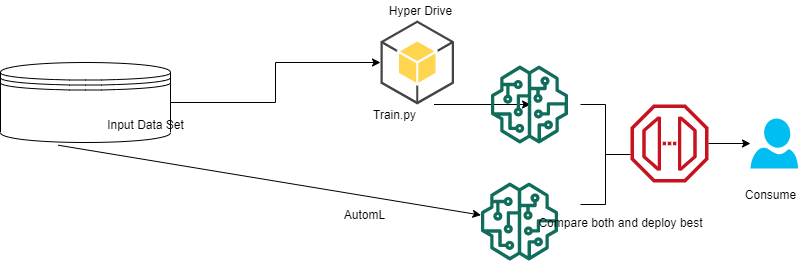

## Business Problem and Dataset  
Diabetes is on eof the diseases  suffered by many people across the globe in recent years. Many scientists are trying to find a permanent cure for this but could not be able to do
it. So I wanted to build a machine learning model with the clinical data available and predict whether a patient is having Diabetes or not based on the symptoms. 
## Dataset 
I have used the dataset from Kaggle which can be found here . [https://www.kaggle.com/kumargh/pimaindiansdiabetescsv](DiabetesDataset) 
## Dataset Description  
1. Pregnancy      : Number Of Pregnacies happend  
2. Glucose        : Blood Glucose Levels  
3. Blood Pressure : Blood Pressure Levels  
4. Skin ThickNess : Triceps Skin Thickness 
5. Insulin        : Blood Insulin Levels 
6. BMI            :Body Mass Index 
7. Diabetes       :Diabetes Function 
8. Age            : Age Of Patient in Years 
9. Outcome        : 1 0r 0 to indicate whether a patient has diabetes or Not 
## Machine Learning Model for the Problem statement 
The data has lot of outliers, some have irrelavant values. All the preprocessing was done and placed in train.py using clean data function. After that I choose Logistic Regression Model to build  as the Problem is binary problem and choosen accuracy as primary metric which needs to be maximised. 
## Dataset into Azure  
Since this is an external dataset we need to register the dataset by going to create a new dataset in Azure Machine learning studio, also we can do this by using python sdk  
I have tested both ways. Once Dataset is registered we need to convert the dataset to Tabular dataset using Tabular Dataset factory module of Azure Machine learning. 

## Azure ML Hyper Drive  
Since the model is Logistic regression I have choosen Inverse Regularisation factor (--C)  which penalises the model to prevent over fitting and maximum number of iteration(--Max_iter) as other Hyperparameter to be tuned. 
**Sampling Used** I have choosen Random parameter sampling to tune the Hyper parameters to save the computational cost and time of completion. 
**Early STopping Technique** I have choosen Bandit policy as it terminates the model building if any of the conditions like slack factor, slack amout, delay interval are not met as per prescribed limits during maximizing the accuracy. 
We need to pass the hyperparameter using an entry scriot in my case its train.py file having all the preprocessing steps and Hyperparameters using arg.parser method to be passed to Hyper Drive. 
Once we pass the Hyper parameters using train.py  and submit the Job Hyper Drive will create number of jobs based on the parameters given in Hyperdrive configuration using the combinations of Hyper parameters . After running all the 20 models we find the best model and  register it in the portal. 
We can see the Hyper Drives running as below. 
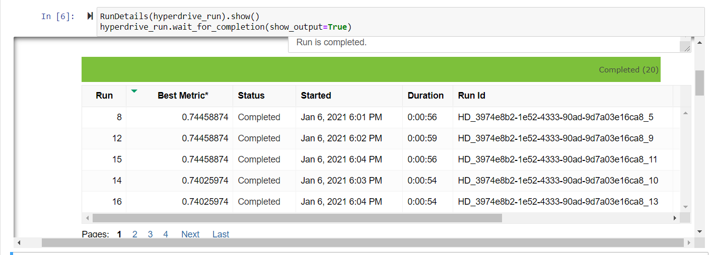
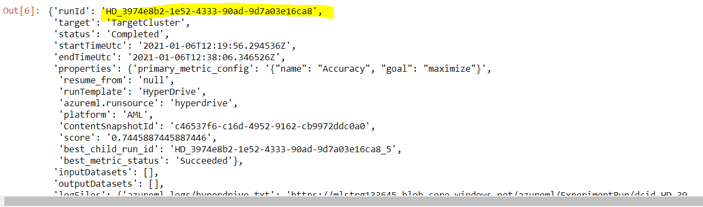
Once the Run details are completed we fetch the best run . 
We will regsiter the model for future use. 
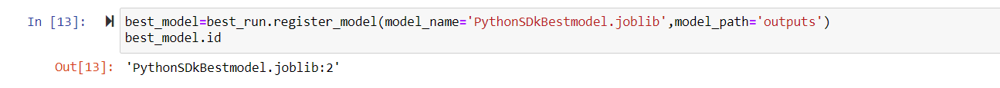 
The Registerd model can be seen under models in Azure Machine learning studio ,  a new version of the model is registered everytime we run register. So we have two models registerred. 

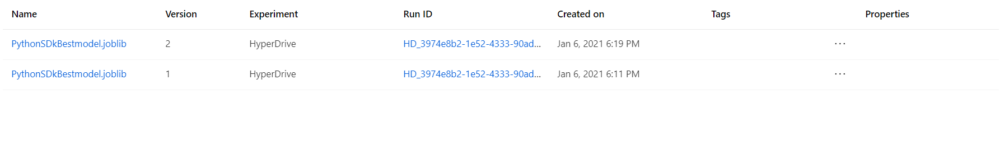 
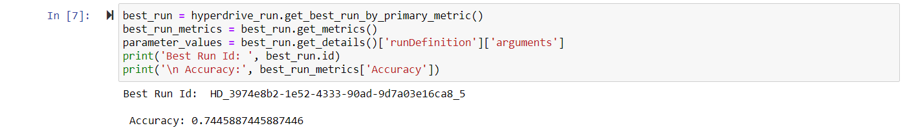
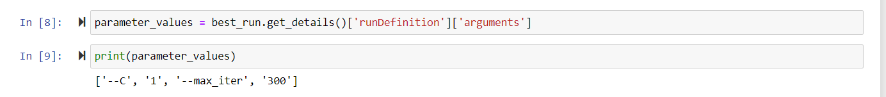 
This shows the successful completion of Hyperdrive model Running along with best parameters and accuracy. 
## Compute Cluster 
To run the Jobs we need a target cluster to be created before starting the process whcih can be found in both the notebooks .  
## Auto Ml  
Hyper Drive run needs lot of preprocessing technqiues for the successful building of a model. Azure has AUTOML capalbilities with less preprocessing techniques reuqired . Here we are going to  build a automl model for our problem. The Dataste is registered and converted to Tabular Dataset using Tabular dataset Factory module. 
The AutomL config can be as seen below. 
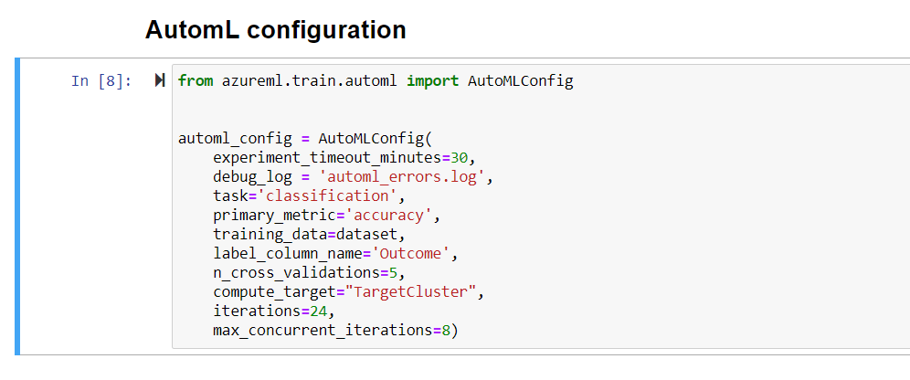 

Since the probelm is classification we choose task as classification. 
TimeOut is set to 30 minutes sicne the dataset is only 800 rows approximately. 
Primary metric is accuracy as we are trying to maximise the accuracy. 
label column is the column we are trying to predict here outcome . 
Compute target is the target cluster where the computation needs to be done 
N_cross_Validations=5 the number of k fold cross validations, since the dataset is small choosen 5  
Iterations: Number of iterations to be run 24 , so this checks 24 automl models<be>
Max_concurernt_iterations: 8 number of parallel runs at a time, choosing this too high impact performance so choosen 8 
Once we write the config file and submit the experiment it starts building models whcih can be seen below. 
 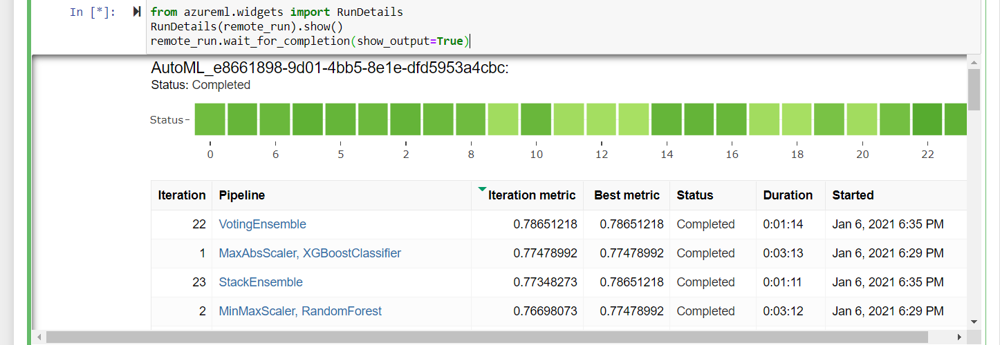 
  Once the run completes we find the best model and register that. 
  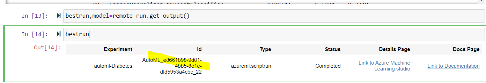 
After all the Runs AutomL gave voting ensemble model as best model with accuracy of 78.39 better than HYperdrive model.**VotingEnsemble** model works on taking the majority voting of underlying models and choose the model with highest votes as best model. 
 The Fitted Model Parameters are as shown below 
  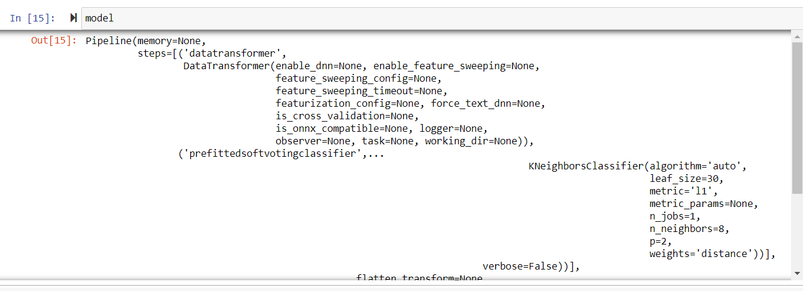
  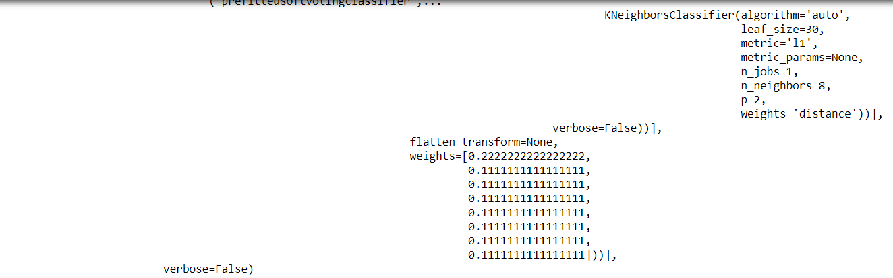 
  Once we have the best model we will register it using model register module. 
   
  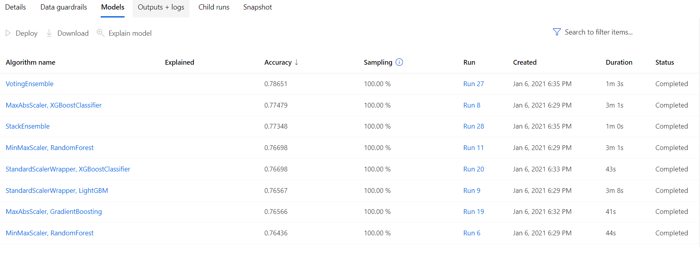 
  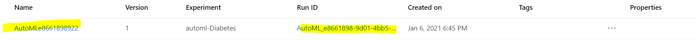 
  The Model Resgister codes are available in Jupyter Notebooks. 
  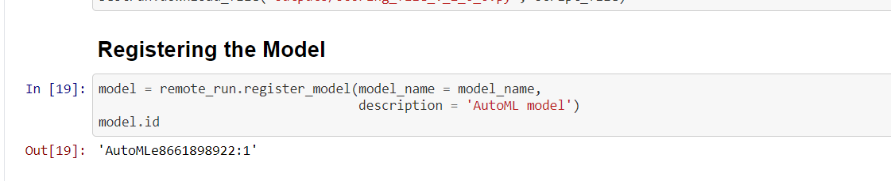 
 ## Deployment  
  Now both models are tested we choose automl model to be deployed as it gave better accuarcy compared to HyperDrive Model.  Before Deploying the model we need to pack all the dependencies into conda environment file whcih are included in the repository. Once we pack the dependencies a docker conatiner is built and pushed to Azure Container isntance. We need to consume the ACI instance using a rest Endpoint. The endpoint deployed will be seen in endpoints section of the Azure Machine learning studio. Before deploying an endpoint we need to define scoring script which defines the entrypoint to the deployment whcih is given in repository. 
 We need to define inference config and endpoint config which are in jupyter Notebook of Automl. 
 Once the end point is deployed and shwoing healthy its ready to cosnume 
 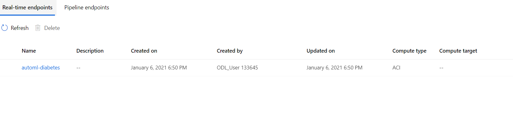
 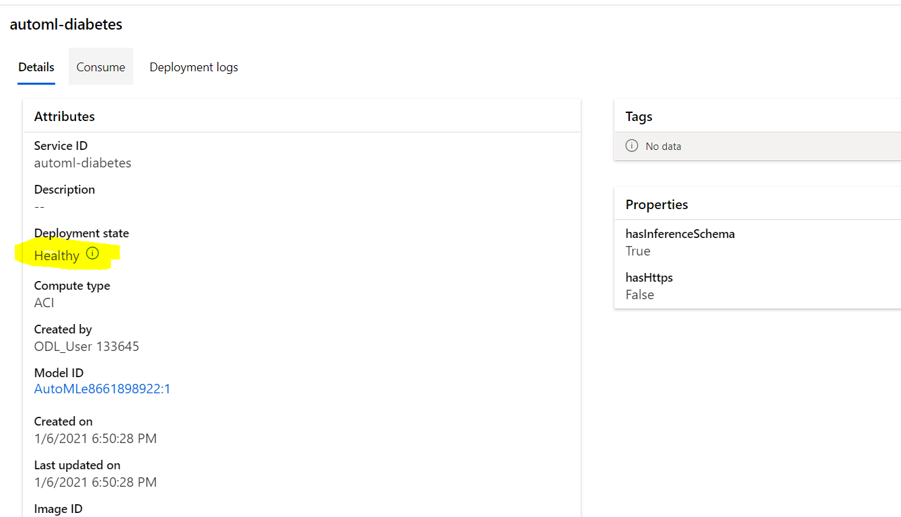 
 This shows the Endpoint is successfully deployed and is healthy.Now we can consume the endpoint using scoring URL genereated after deployment. 
 The Endpoint is consumed using endpoint.py where we use requests library for cosnuming the endpoint. 
 The sample input to the endpoint is as below 
 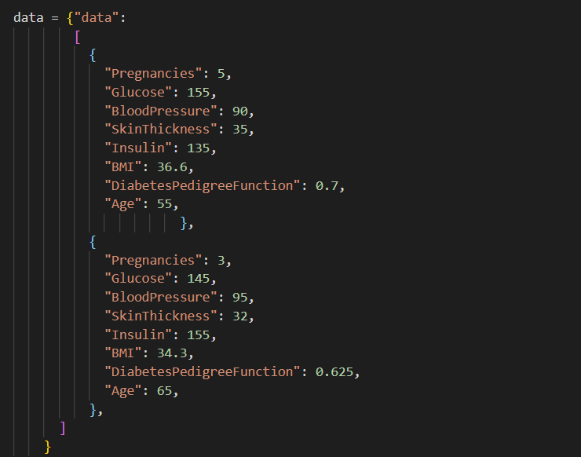 
 Here we are testing two datapoints and we are expecting two outputs. This can be seen in next image 
 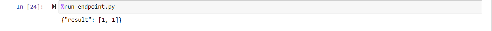 
 In the same way we can test the endpoint on multiple Data points using sample data from the given dataset. 
 We convert the sample dataframe into json and pass the json to service endpoint. 
 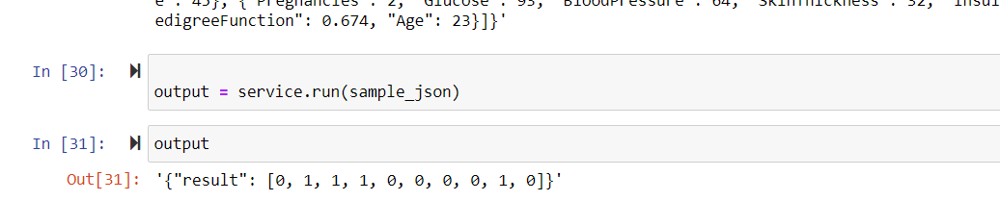 
 This shows the endpoint is functioning successfully.
 ## Video Casting Explaining the Process
 [https://youtu.be/lzueNMlqs0w](Youtubelink) 
 ## Future Enhancements  
 The model can be converted to ONNX format and deploy on Edge devices. 
 Applciation insights can be enabled. 
 
 
 
 
  
 
  

